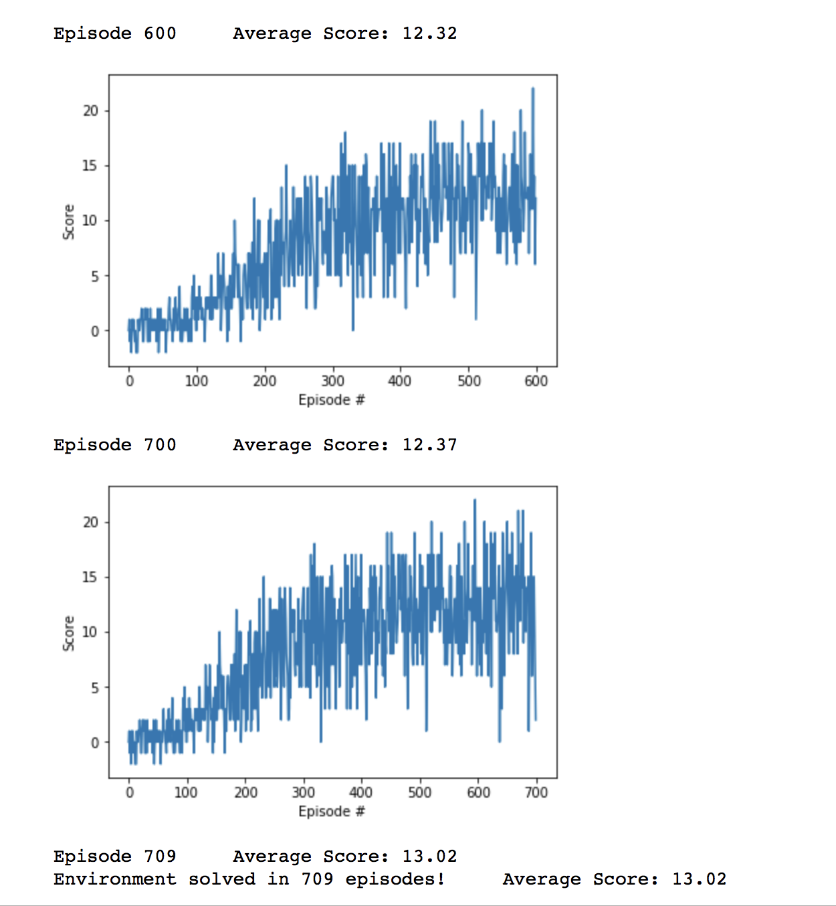

# Report
In Reinforcement Learning (RL), an agent interacts with an environment and tries to maximize the expected cumulative future reward. RL problems are typically modeled as Markov Decision Processes (MDP) where the current state contains all the relevant information for the agent.  
An agent decides which action to take according to the current policy given the current state. In return, the environment gives the next state and a reward. The goal of the agent is to take actions in order to maximize cumulative future reward.  
This GitHub repository provides an implementation of an agent applied to the Banana Environment from Unity. There a robot tries to eat as many yellow and as few blue bananas as possible navigating through the environment with the acitons right, left, stop, forward. The environment is considered as solved if the agent achieves an average reward of at least 13 for 100 consecutive episodes. 
  
### Algorithm
Take a look at: 
Deep Q Learning 
See: 
[Dropwizard](https://deepmind.com/research/dqn/)
 
The agent is trained via Deep Q Learning according to the paper. A DNN is optimized to estimate the correct action value function of the environment. 
 
Double Q Learning.  
See: 
[Dropwizard](https://arxiv.org/pdf/1509.06461.pdf) 
In order to reduce overestimation of Q-values, we use Double deep Q learning. The target computation is performed via the online DNN in 20 percent of the updates (see Hyperparameters p_second). 
Dueling Q Networks 
See:
 
[Dropwizard](https://arxiv.org/pdf/1511.06581.pdf) 
In addition to DQN we also implemented a DNN according to the dueling DQN algorithm. You can decide when you create an agent (in main.ipynb) which one to use. 
### Hyperparameter:
- DNN:
>    - Batch_size = 64
>    - Gamma = 0.99
>    - Lr = 5e-4
>    - Optimizer: Adam
>    - Update_every = 4
>    - Tau = 1e-3

- Replay Memory:
>    - Buffer_size = int(1e5)

- Double Q Learning:
>    - p_second = 0.2
 

The DNN was trained with a batch size of 64 and a learning rate of 5e-4. The used optimizer was Adam and a update was performed every fourh action of an agent. The memory buffers maximal size is 1e5. The parameters of the target DNN were updated after each update of the online DNN weighted by Tau. The probability to compute the target with the online DNN was 20 percent (p_second).

## DNN Architecture
In <samp>model.py</samp> : 
Function for the usual deep Q learning (without dueling networks): 
<samp> DNN</samp>: 
Simple feed-forwad DNN which maps a 37 dimensionial input to a 4 dimensional output.  
Shape Layer 1: 
(state_size, 2*state_size) 
Shape Layer 2: 
(2*state_size, state_size) 
Shape Layer 3: 
(state_size, state_size)
Shape Layer 4: 
(state_size, action_size) 
Activation Layer 1 to 3: 
Rectified Linear Unit 
 
Dueling DNN: 
<samp> DNN_dueling</samp>: 
Feed-forwad DNN which maps a 37 dimensionial input to a 4 dimensional output.  
Shape Layer 1: 
(state_size, 2*state_size) 
Shape Layer 2: 
(2*state_size, state_size) 
Shape Layer 3: 
(state_size, state_size)
Shape Layer 4: 
(state_size, state_size) 
Activation Layer 1 to 4: 
Rectified Linear Unit 
After these layers, the DNN takes to paths, one to estimate a single output (similar to the state value function) and to estimate improvement values for each action. 
Shape Layer 5a/b: 
(state_size, 2*state_size) 
Shape Layer 6a/b: 
(2*state_size, state_size) 
Shape Layer 7a: 
(state_size, action_size)
 
Shape Layer 7b:
(state_size, 1)
 
Output Shape: 
(action_size) 
Output is a function of 7 a and b. (Dueling DQN)
## Future Ideas
- Make the Prioritized Experience Replay work
- Use pixels as agent input. For this, a CNN architecture is required. Maybe in combination with LSTMS... 
- Implement some preprocessing for the pixels
- Play around with the double DQN
- Use policy based RL learning methods
- Use actor critic based RL methods
- Use multiple agents at the same time to compete for the most bananas (how do the agents act, if another agent just its their banana in front of their nose ?)

