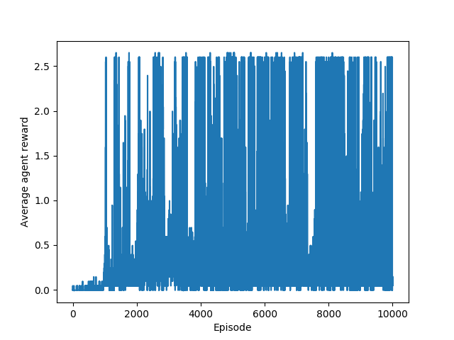
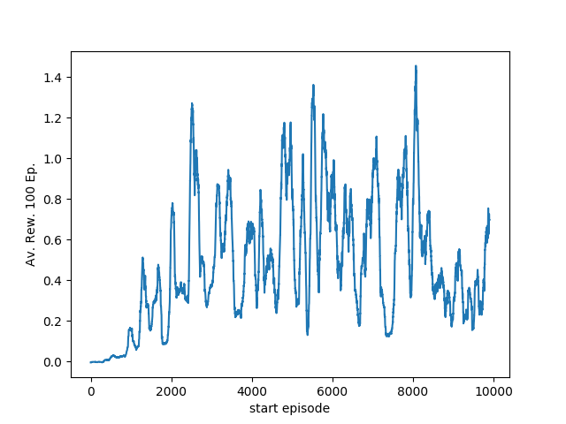

# Report
In Reinforcement Learning (RL), an agent interacts with an environment and tries to maximize the expected cumulative future reward. RL problems are typically modeled as Markov Decision Processes (MDP) where the current state contains all the relevant information for the agent.  
An agent decides which action to take according to the current policy given the current state. In return, the environment gives the next state and a reward. The goal of the agent is to take actions in order to maximize cumulative future reward.  
This GitHub repository provides an implementation of an agent applied to the tennis environment from Unity. There are two tennis playing agents. The environment is considered solved when the average reward over 100 episodes is at least 0.5.

The rewards of each episode are saved in rewards.pkl If you read the reward file 'reward_file = pickle.load(open('rewards.pkl','rb')).

Here a plot of the cumulative future reward over 100 episodes (average over both agents):

The environment was solved in episode 1284

### Algorithm
Take a look at: 
DDPG 
See: 
[Dropwizard](https://arxiv.org/abs/1509.02971)
 
The agent is trained via deep deterministic policy gradients, a combination of deep q learning and policy based reinforcement learning. A DNN is optimized to estimate the correct action value function of the environment and another DNN determines the continuous actions. After 104 episodes the average reward over all agents and 100 episodes was above 30.
There are two ddpg networks, one for each agent. They are both trained. No shared replay buffer. 
### Hyperparameter:
- DNN:
>    - Batch_size = 512
>    - Gamma = 0.99
>    - Lr Actor = 5e-5
>    - Lr Critic = e-3
>    - Optimizer: Adam
>    - Update_every = 2
>    - Tau = 1e-3
- Replay Memory:
>    - Buffer_size = int(1e5)
 

The DNN was trained with a batch size of 512 and a learning rate of 5e-5 for the actor and e-3 for the Critic. The used optimizer was Adam and a update was performed every fourh action of an agent. The memory buffers maximal size is 1e5. The parameters of the target DNN were updated after each update of the online DNN weighted by Tau.
## DNN Architecture
In <samp>model.py</samp> : 
Function for the usual deep policy learning : 
<samp> Actor</samp>: 
Simple feed-forwad DNN which maps a 24 dimensionial input to a 4 dimensional output (the continuous actions) - including batchnormalization.  
Batchnormalization Layer 1: 
(state_size) 
Shape Layer 1: 
(state_size, 400) 
Batchnormalization Layer 2: 
(400) 
Shape Layer 2: 
(400, 300) 
Batchnormalization Layer 3: 
(300) 
Shape Layer 3: 
(300, 4)
Activation Layer 1 to 3: 
Rectified Linear Unit 
 
Output activation: 
Tanh 
Function for the usual deep q learning: 
<samp>Critic</samp>: 
Feed-forwad DNN which maps a 24 dimensionial input to a 1 dimensional output. Later in the DNN, the actor outputs are added to compute the specific Q value for the state and input setting.  
Batchnormalization Layer 1: 
(state_size) 
Shape Layer 1: 
(state_size, 400) 
Batchnormalization Layer 2: 
(400) 
Shape Layer 2: 
(400+4, 300) 
Batchnormalization Layer 3: 
(300) 
Shape Layer 3: 
(300, 1) 
Activation Layer 1 to 3: 
Rectified Linear Unit 
Output activation: 
Tanh 
## Future Ideas
- Include PPO and find out how to use for continuous action spaces
- Use pixels as agent input. For this, a CNN architecture is required. Maybe in combination with LSTMS...
- Implement some preprocessing for the pixels
- Find a way to connect the agents, right now they are independent of each other
- find out if there are better noise processe ...
